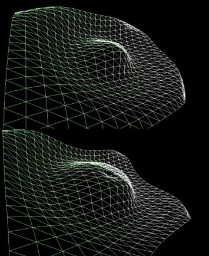



## Cool Direct3D Waves

### Description

This is a program that shows how to use Direct3D and directx. It's a cool 3D wave that is generated in the center of a plane and expands out. In addition, the plane rotates in the X,Y and Z axis. Try chaging some equations. Sometimes you get weird looking stuff. Please, vote if you like it! Give me feedback
 
### More Info
 

             |
---                |---
**Submitted On**   |2000-11-08 20:43:38
**By**             |[Luiz L Cruz](https://github.com/Planet-Source-Code/PSCIndex/blob/master/ByAuthor/luiz-l-cruz.md)
**Level**          |Intermediate
**User Rating**    |4.9 (73 globes from 15 users)
**Compatibility**  |VB 5\.0, VB 6\.0
**Category**       |[DirectX](https://github.com/Planet-Source-Code/PSCIndex/blob/master/ByCategory/directx__1-44.md)
**World**          |[Visual Basic](https://github.com/Planet-Source-Code/PSCIndex/blob/master/ByWorld/visual-basic.md)
**Archive File**   |[CODE\_UPLOAD114841182000\.zip](https://github.com/Planet-Source-Code/luiz-l-cruz-cool-direct3d-waves__1-12646/archive/master.zip)

